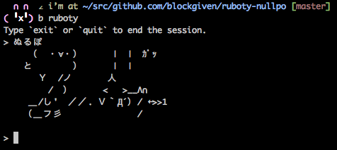

# Ruboty::Nullpo

ruboty plugin for ぬるぽ ガッ.



## Installation

Add this line to your application's Gemfile:

```ruby
gem 'ruboty-nullpo'
```

And then execute:

    $ bundle

Or install it yourself as:

    $ gem install ruboty-nullpo

## Usage

```
ぬるぽ

　　 （　・∀・）　　　|　|　ｶﾞｯ
　　と　　　　）　 　 |　|
　　　 Ｙ　/ノ　　　 人
　　　　 /　）　 　 < 　>__Λ∩
　　 ＿/し'　／／. Ｖ｀Д´）/ ←>>1
　　（＿フ彡　　　　　 　　/
```

## Contributing

1. Fork it ( https://github.com/blockgiven/ruboty-nullpo/fork )
2. Create your feature branch (`git checkout -b my-new-feature`)
3. Commit your changes (`git commit -am 'Add some feature'`)
4. Push to the branch (`git push origin my-new-feature`)
5. Create a new Pull Request
